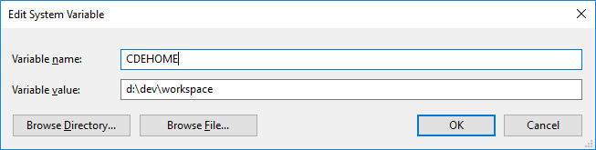

# COMMON DEVELOP ENVIRONMENT #

## 1 Abstract

The Common Develop Environment is the standard development environmentused by me.

## 2 Table of Content

- [3 Overview](#3-overview)
- [4 Workspace](#4-workspace)
    - [4.1 Hierarchy Overview](#41-hierarchy-overview)
    - [4.2 The *CDEHOME* Environment Variable](#42-the-cdehome-environment-variable)
        - [4.2.1 Set *CDEHOME* On Windows](#421-set-cdehome-on-windows)
        - [4.2.2 Set *CDEHOME* On Mac or Linux](#422-set-cdehome-on-mac-or-linux)
    - [4.3 The *pkgs* Directory](#43-the-pkgs-directory)
        - [4.3.1 PKGHOME Variable](#431-pkghome-variable)
        - [4.3.2 Pkg Solution File and Makefile](#432-pkg-solution-file-and-makefile)
        - [4.3.3 Naming of Output Directory](#433-naming-of-output-directory)
        - [4.3.4 Example](#434-example)
    - [4.4 The *docs* Directory](#44-the-docs-directory)
        - [4.4.1 Repository Wiki](#441-repository-wiki)
        - [4.4.2 The *open-docs* Directory](#442-the-open-docs-directory)
    - [4.5 The *build* Directory](#45-the-build-directory)
    - [4.6 The *external* Directory](#46-the-external-directory)
    - [4.7 The *src* Directory](#47-the-src-directory)
- [5 Tools and Configuration](#5-tools-and-configuration)
    - [5.1 Git](#51-git)
        - [5.1.1 Install](#511-install)
        - [5.1.2 Authentication](#512-authentication)
        - [5.1.3 Initialize](#513-initialize)
        - [5.1.4 Checkout](#514-checkout)
        - [5.1.5 Commands Help](#55-commands-help)
    - [5.2 Bash](#52-bash)
    - [5.3 Visual Studio](#53-visual-studio)
        - [5.3.1 Version](#531-version)
    - [5.4 Visual Studio Code](#54-visual-studio)
    - [5.5 Windows Kits](#54-windows-kits)
        - [5.5.1 SDK](#551-sdk)
        - [5.5.2 WDK](#552-wdk)
- [6 Project Settings](#6-project-settings)
    - [6.1 Visual Studio Project Settings](#61-visual-studio-project-settings)
    - [6.2 Visual Studio Code Workspace Settings](#62-visual-studio-code-workspace-settings)
    - [6.3 XCode Project Settings](#63-xcode-project-settings)
- [7 Build and Output](#7-build-and-output)
    - [7.1 Output Directory](#71-output-directory)
    - [7.2 Build by Visual Studio](#72-build-by-visual-studio)
    - [7.3 Build by MSBuild](#73-build-by-msbuild)
    - [7.4 Build by GNU Make](#74-build-by-gnu-make)
- [8 Code Signing](#8-code-signing)
    - [8.1 Tools](#81-tools)
    - [8.2 Certificates](#82-certificates)
- [9 Debugging](#9-debugging)
    - [9.1 Settings](#91-tools)
        - [9.1.1 System Variables](#911-system-variables)
        - [9.1.2 Paths](#912-paths)
    - [9.2 Tools](#91-tools)
        - [9.2.1 WinDBG](#921-windbg)
        - [9.2.2 UMDH](#922-umdh)
- [10 Others](#10-others)
- [**Appendix**](#appendix)


## 3 Overview

- All my code and documents are kept in a single *workspace* with predefined directory hierarchy.

## 4 Workspace

### 4.1 Hierarchy Overview

```
$(CDEHOME)/             # The root directory of workspace
    pkgs/               # Distribute packages
        pkg1/           # Package 1
        pkg2/           # package 2
        ......
    docs/               # All the documents (private & public)
        open-docs/      # All the public documents
        repo-docs/      # Repository documents
        ......
    build/              # Common Build Scripts (CBS)
    external/           # All 3rd-party libraries
    src/                # All the source code
        repo1/          # Repository 1
        repo2/          # Repository 2
        ......
```

### 4.2 The *CDEHOME* Environment Variable

The `CDEHOME` environment variable specifies the root directory of Lintcut Workspace. Users must defines this environment variable before they start any real work.

#### 4.2.1 Set *CDEHOME* On Windows

A new system variable `CDEHOME` should be added:




#### 4.2.2 Set *CDEHOME* On Mac or Linux

The `CDEHOME` variable shoudl be exported when system start. For example, add following line in your `.bashrc` file (e.g. `~/.bashrc`)

```bash
export CDEHOME=~/dev/workspace
```

### 4.3 The *pkgs* Directory

The `pkgs` directory contains multiple sub-directories named with `distribute package name`. And under each project directory, there are multiple `output` directory for different build targets.

- pkg solution file (for Visual Studio Projects)
- pkg Makefile (for Non-Visual_studio Projects)

#### 4.3.1 PKGHOME variable

Each pkg has its own $(PKGHOME) variable, which is:

    $(CDEHOME)/pkgs/<pkgname>

#### 4.3.2 Pkg Solution File and Makefile

For Visual Studio Project, each pkg has its own pkg.sln file which includes all the projects used by this package.
For other projects, we also provide a makefile to build them.
Directory hierarchy is like this:

```
$(CDEHOME)/pkgs/<pkgName>/
    pkg.sln
    Makefile
    output/
        win_x86_release_mt/
        win_x86_debug_mt/
        ...
```

#### 4.3.3 Naming of Output Directory

The output directory names is like this:

```
output/<os>_<cpu>_<config>_<linktype>
```

**OS**

- `win` - Target OS is Windows
- `mac` - Target OS is Mac
- `linux` - Target OS is Linux
- `ios` - Target OS is iOS (iPhone or iPad)
- `android` - Target OS is Android

**CPU**

- `x86` - Target CPU Architect is x86
- `x64` - Target CPU Architect is x64 (amd64)
- `ia64` - Target CPU Architect is Intel IA64
- `arm` - Target CPU Architect is ARM

**BUILD CONFIG**

- `release` - Release Build
- `debug` - Debug Build

**LINK TYPE**

- `mt` - Staticly link to runtime libraries
- `md` - Dynamically link to runtime libraries


#### 4.3.4 Example

```
$(CDEHOME)/bin/
    xauth/
        xauth.sln
        output/win_x86_debug_mt/
        output/win_x86_debug_md/
        output/win_x86_release_mt/
        output/win_x86_release_md/
        output/win_x64_debug_mt/
        output/win_x64_debug_md/
        output/win_x64_release_mt/
        output/win_x64_release_md/
    xvault/
        xvault.sln
        Makefile
        output/win_x86_debug_mt/
        output/win_x86_debug_md/
        output/win_x86_release_mt/
        output/win_x86_release_md/
        output/win_x64_debug_mt/
        output/win_x64_debug_md/
        output/win_x64_release_mt/
        output/win_x64_release_md/
        output/mac_x64_debug_md/
        output/mac_x64_release_md/
        output/ios_arm_debug_md/
        output/ios_arm_release_md/
```

### 4.4 The *docs* Directory

This directory contains all the documents (private or public)

### 4.5 The *open-docs* Directory

This directory contains all the public documents

### 4.6 The *build* Directory

This directory contains `Common Build Scripts (CBS)`.

**Check Out**

```bash
git clone git@bitbucket.org:lintcut/cbe.git $(CDEHOME)/build
```

### 4.7 The *external* Directory

All 3rd-party libraries are put in `external` directory, with following directory hierarchy:

```
<Library Name>/
    <version>/
        bin/
        include/
        libs/
```

For example,

```
$(CDEHOME)/external/
    boost/
        1_59_0/
            include/
            libs/
                win_x86_release_mt/
                win_x86_debug_mt/
                win_x86_release_md/
                win_x86_debug_md/
                win_x64_release_mt/
                win_x64_debug_mt/
                win_x64_release_md/
                win_x64_debug_md/
    cppunit/
        1.12.1/
            include/
            libs/
                win_x86_release_mt/
                win_x86_debug_mt/
                win_x86_release_md/
                win_x86_debug_md/
                win_x64_release_mt/
                win_x64_debug_mt/
                win_x64_release_md/
                win_x64_debug_md/
    openssl/
        1.0.2d/
            bin/
                win32/
                x64/
            include/
            libs/
                win_x86_release_mt/
                win_x86_debug_mt/
                win_x86_release_md/
                win_x86_debug_md/
                win_x64_release_mt/
                win_x64_debug_mt/
                win_x64_release_md/
                win_x64_debug_md/
```

### 4.8 The *src* Directory

All the source code goes to this here, with following directory hierarchy:

```
<Repo Name>/
    <version>/
        bin/
        include/
        libs/
```


## 5 Tools and Configuration

### 5.1 Git

#### 5.1.1 Install

- **Download**

    Developer should download Git from official site: [git-scm.com](https://git-scm.com/downloads)

- **Install**

    *On Windows*

    1. Built-in bash should be installed
    2. Download GNU make from [here](setup-guide.files/make-x64.zip)
    3. Unzip it and copy to "C:\Program Files\Git\usr\bin\make.exe"

#### 5.1.2 Authentication

I use SSH as authentication method.

Since I have more than one git accounts from same or different providers. I config my git login like this:

1. Create SSH Keys and config it on server side following provider's guide.

    **Create SSH Key**

    ```bash
    ssh-keygen -t -rsa -C "email address"
    ```

    *For Example*
    
    ```bash
    ssh-keygen -t -rsa -C "username@gmail.com"
    ssh-keygen -t -rsa -C "username@company.com"
    ```

2. Edit config file - `"~/.ssh/config"` (on Windows: `"C:/Users/<name>/.ssh/config"`), and add following content.

    ```
    Host <alias1>
        HostName <host1>
        PreferredAuthentications publickey
        IdentityFile <privateKey1 Path>
    Host <alias2>
        HostName <host2>
        PreferredAuthentications publickey
        IdentityFile <privateKey2 Path>
    ```

    For example:
    
    ```
    Host bitbucket-personal
        HostName bitbucket.org
        PreferredAuthentications publickey
        IdentityFile ~/.ssh/id_rsa_bitbucket_personal
    Host bitbucket-company
        HostName bitbucket.org
        PreferredAuthentications publickey
        IdentityFile ~/.ssh/id_rsa_bitbucket_company
    Host github-personal
        HostName github.com
        PreferredAuthentications publickey
        IdentityFile ~/.ssh/id_rsa_github_personal
    ```

    **NOTE**

    From now on, you should use alias in your git command. For example,

    *Clone a personal Github repository*
    
    `"git@github.com"` should be changed to `"git@github-personal"`

    ```
    git clone git@github-personal:<personal-username>/personal-repository.git
    ```
    
    *Clone a company Git repository*
    
    `"git@github.com"` should be changed to `"git@github-company"`
    
    ```
    git clone git@github-company:<company-username>/comapny-repository.git
    ```

3. Add keys to SSH Agent

    ```
    ssh-add ~/.ssh/id_rsa_bitbucket_personal
    ssh-add ~/.ssh/id_rsa_bitbucket_company
    ssh-add ~/.ssh/id_rsa_github_personal
    ```

4. Test Key

    Run command `"ssh -T git@<alias>"` to test keys configuration. For example,

    ```
    ssh -T git@github-personal
    ssh -T git@github-company
    ssh -T git@bitbucket-personal
    ```

    Server should return following information

    ```
    From Bitbucket:

        logged in as <Account UserName>.
        You can use git or hg to connect to Bitbucket. Shell access is disabled.

    From Github:

        Hi <Account UserName>! You've successfully authenticated, but GitHub does not provide shell access.    
    ```

5. Try it out

    You can run some common git commands to try it out. For example,

    ```bash
    git clone git@bitbucket-company:username/company-project.git ./project-folder
    cd project-folder
    git log --pretty=format:%h - %an, %ar : %s
    touch NewFile.md
    git commit -am "Add a new Markdown file"
    git push
    ```

#### 5.1.3 Initialize

#### 5.1.4 Checkout

#### 5.1.5 Commands Help

### 5.2 Bash

### 5.3 Visual Studio

#### 5.3.1 Version

### 5.4 Visual Studio Code

### 5.5 Windows Kits

#### 5.5.1 SDK

#### 5.5.2 WDK

## 6 Project Settings

### 6.1 Visual Studio Project Settings

### 6.2 Visual Studio Code Workspace Settings

### 6.3 XCode Project Settings

## 7 Build and Output

### 7.1 Output Directory

The output directory names is like this:

```
<os>_<cpu>_<config>_<linktype>
```

#### Definition 

*OS*

- `win` - Target OS is Windows
- `mac` - Target OS is Mac
- `linux` - Target OS is Linux
- `ios` - Target OS is iOS (iPhone or iPad)
- `android` - Target OS is Android

*CPU*

- `x86` - Target CPU Architect is x86
- `x64` - Target CPU Architect is x64 (amd64)
- `ia64` - Target CPU Architect is Intel IA64
- `arm` - Target CPU Architect is ARM

*BUILD CONFIG*

- `release` - Release Build
- `debug` - Debug Build

*LINK TYPE*

- `mt` - Staticly link to runtime libraries
- `md` - Dynamically link to runtime libraries

#### Examples

*Windows Example*

    ```
    win_x64_release_md
    win_x64_release_mt
    win_x64_debug_md
    win_x64_debug_mt
    win_x86_release_md
    win_x86_release_mt
    win_x86_debug_md
    win_x86_debug_mt
    ```

*Mac Example*

    ```
    mac_x64_release_md
    mac_x64_release_mt
    mac_x64_debug_md
    mac_x64_debug_mt
    ```
    
*iOS Example*

    ```
    ios_arm_release
    ios_arm_debug
    ```


### 7.2 Build by Visual Studio

### 7.3 Build by MSBuild

### 7.4 Build by GNU Make

## 8 Code Signing

### 8.1 Tools

### 8.2 Certificates

## 9 Debugging

### 9.1 Settings

#### 9.1.1 System Variables

#### 9.1.2 Paths

### 9.2 Tools

#### 9.2.1 WinDBG

#### 9.2.2 UMDH

## 10 Others

## **Appendix**
