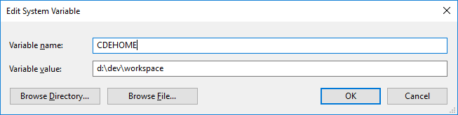

# COMMON DEVELOP ENVIRONMENT #

## 1 Abstract

The Common Develop Environment is the standard development environment

## 2 Table of Content

- [3 Overview](#3-overview)
- [4 Workspace Hierarchy](#4-directory-hierarchy)
    - [4.1 Hierarchy Overview](#41-hierarchy-overview)
    - [4.2 The *CDEHOME* Environment Variable](#32-the-cdehome-environment-variable)
        - [4.2.1 Set *CDEHOME* On Windows](#421-set-cdehome-on-windows)
        - [4.2.2 Set *CDEHOME* On Mac or Linux](#422-set-cdehome-on-mac-or-linux)
    - [4.3 The *pkgs* Directory](#43-the-pkgs-directory)
        - [4.3.1 Naming of Output Directory](#431-naming-of-output-directory)
        - [4.3.2 Example](#432-example)
    - [4.4 The *docs* Directory](#44-the-docs-directory)
    - [4.5 The *open-docs* Directory](#45-the-open-docs-directory)
    - [4.6 The *build* Directory](#46-the-build-directory)
    - [4.7 The *external* Directory](#47-the-external-directory)
    - [4.8 The *src* Directory](#47-the-src-directory)
- [5 Projects](#4-projects)
    - [4.1 My Projects](#41-my-projects)
        - [4.1.1 xCL](#411-xcl)
        - [4.1.2 xAuth](#411-xauth)
        - [4.1.3 xVault](#411-xvault)
    - [4.2 Others Projects](#42-others-projects)
- [5 Useful External Documents](#5-useful-external-documents)
    - [5.1 RFCs](#51-rfcs)
    - [5.2 Microsoft](#52-microsoft)
        - [5.2.1 Guidelines](#521-guidelines)
    - [5.3 Google](#53-google)
        - [5.3.1 Style Guidelines](#531-style-guidelines)
- [6 Others](#6-others)


## 3 Overview

- All my code and documents are kept in a single *workspace*

## 4 Workspace Hierarchy

### 4.1 Hierarchy Overview

```
$(CDEHOME)/             # The root directory of workspace
    pkgs/               # Distribute packages
    docs/               # All the documents (private & public)
    open-docs/          # All the public documents
    build/              # Common build environment (CBE)
    external/           # All 3rd-party libraries
    src/                # All the source code
```

### 4.2 The *CDEHOME* Environment Variable

The `CDEHOME` environment variable specifies the root directory of Lintcut Workspace. Users must defines this environment variable before they start any real work.

#### 4.2.1 Set *CDEHOME* On Windows

A new system variable `CDEHOME` should be added:




#### 4.2.2 Set *CDEHOME* On Mac or Linux

The `CDEHOME` variable shoudl be exported when system start. For example, add following line in your `.bashrc` file (e.g. `~/.bashrc`)

```bash
export CDEHOME=~/dev/workspace
```

### 4.3 The *pkgs* Directory

The `pkgs` directory contains multiple sub-directories named with `distribute package name`. And under each project directory, there are multiple `output` directory for different build targets.

- pkg solution file (for Visual Studio Projects)
- pkg Makefile (for Non-Visual_studio Projects)

#### 4.3.1 Naming of Output Directory

The output directory names is like this:

```
<os>_<cpu>_<config>_<linktype>
```

**OS**

- `win` - Target OS is Windows
- `mac` - Target OS is Mac
- `linux` - Target OS is Linux
- `ios` - Target OS is iOS (iPhone or iPad)
- `android` - Target OS is Android

**CPU**

- `x86` - Target CPU Architect is x86
- `x64` - Target CPU Architect is x64 (amd64)
- `ia64` - Target CPU Architect is Intel IA64
- `arm` - Target CPU Architect is ARM

**BUILD CONFIG**

- `release` - Release Build
- `debug` - Debug Build

**LINK TYPE**

- `mt` - Staticly link to runtime libraries
- `md` - Dynamically link to runtime libraries


#### 4.3.2 Example

```
$(CDEHOME)/bin/
    xauth/
        xauth.sln
        output/win_x86_debug_mt/
        output/win_x86_debug_md/
        output/win_x86_release_mt/
        output/win_x86_release_md/
        output/win_x64_debug_mt/
        output/win_x64_debug_md/
        output/win_x64_release_mt/
        output/win_x64_release_md/
    xvault/
        xvault.sln
        xvault.mak
        output/win_x86_debug_mt/
        output/win_x86_debug_md/
        output/win_x86_release_mt/
        output/win_x86_release_md/
        output/win_x64_debug_mt/
        output/win_x64_debug_md/
        output/win_x64_release_mt/
        output/win_x64_release_md/
        output/mac_x64_debug_md/
        output/mac_x64_release_md/
        output/ios_arm_debug_md/
        output/ios_arm_release_md/
```

### 4.4 The *docs* Directory

This directory contains all the documents (private or public)

### 4.5 The *open-docs* Directory

This directory contains all the public documents

### 4.6 The *build* Directory

This directory contains `Common Build Environment (CBE)`.

**Check Out**

```bash
git clone git@bitbucket.org:lintcut/cbe.git $(LCHOME)/build
```

### 4.7 The *external* Directory

All 3rd-party libraries are put in `external` directory, with following directory hierarchy:

```
<Library Name>/
    <version>/
        bin/
        include/
        libs/
```

For example,

```
$(CDEHOME)/external/
    boost/
        1_59_0/
            include/
            libs/
                win_x86_release_mt/
                win_x86_debug_mt/
                win_x86_release_md/
                win_x86_debug_md/
                win_x64_release_mt/
                win_x64_debug_mt/
                win_x64_release_md/
                win_x64_debug_md/
    cppunit/
        1.12.1/
            include/
            libs/
                win_x86_release_mt/
                win_x86_debug_mt/
                win_x86_release_md/
                win_x86_debug_md/
                win_x64_release_mt/
                win_x64_debug_mt/
                win_x64_release_md/
                win_x64_debug_md/
    openssl/
        1.0.2d/
            bin/
                win32/
                x64/
            include/
            libs/
                win_x86_release_mt/
                win_x86_debug_mt/
                win_x86_release_md/
                win_x86_debug_md/
                win_x64_release_mt/
                win_x64_debug_mt/
                win_x64_release_md/
                win_x64_debug_md/
```

### 4.8 The *src* Directory

All the source code goes to this here, with following directory hierarchy:

```
<Repo Name>/
    <version>/
        bin/
        include/
        libs/
```
